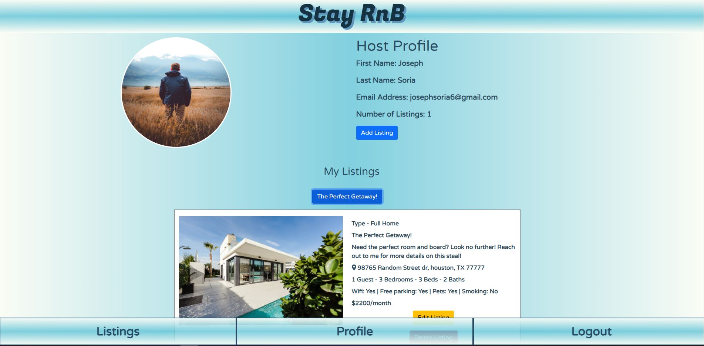

# Stay-RnB

## Table of Contents

1. [Project Description](#project-description)
2. [Web Deployment Link](#web-deployment-link)
3. [Mobile-App Version](#mobile-app-version)
4. [Team Members](#team-members)
5. [Tech Stack](#tech-Stack)
6. [User Story](#user-Story)
7. [Future Releases](#future-releases)
8. [Screenshots](#screenshots)

 ## Project Description

Application for booking room and boarding when you don't need a full apartment or house for rent. When you are looking for the minimum place to stay and sleep without the hassle of paying for full apartments or houses, we are here to solve your problem. Our application will connect the user with property owners that will host their available rooms for boarding. Property owners who have spare bedrooms they want to share out can come sign up to get with users who might need a room for boarding that are looking in the area. 

We will have the web portal for users on their desktop or mobile app if they are on their mobile phones. Stay tuned for more information! 

## Web Deployment Link

Web Deployment: https://stay-rnb-server.herokuapp.com/

## Mobile-App Version
Repo: https://github.com/erumd/Stay-RnB-Mobile

Deployment: To be deployed to the Play Store on Android & Apple Store on iOS

## Team members
Erum Dhukka - Mobile application development
  - GitHub: https://github.com/erumd
  - Email: erumdhukka531@gmail.com

Joseph Soria - Server-side development
  - Deploy: https://stay-rnb-server.herokuapp.com/
  - GitHub: https://github.com/Joeseff6
  - Email: josephsoria6@gmail.com

Tony Tran - Desktop/React application development/Project Manager
  - GitHub: https://github.com/code-monkey713
  - Email: tony.tran713@outlook.com

## Tech Stack
This is a standard MERN application, so the stack consists of:
  - MongoDB/MongoDB Atlas for NoSQL databasing
  - Express.js for server handling and middleware
  - React for front-end user-interfacing and logic
  - Node.js for package management

## User Story
AS A person who travels and needs a place for board

I WANT to book a room-and-board for an intermediate period of time

## Future Releases
- Add ability for users to view listing for booking process
- Add booking functionality to User login
- Add ability for the User to message the Host
- Add ability for the User/Host to edit information in their profile
- Expand search ability to find listings in a radius of the desired zip code
- Add "Forgot password" functionality for users to reset account password
- Allow users to upload pictures of themselves and their listings (default is hardcoded)

## Screenshots

